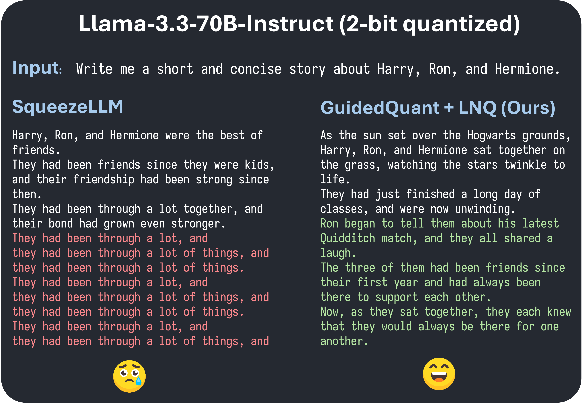

<p align=center>
<div align=center>

</div>
<h1 align="center">GuidedQuant</h1>
</p>
<p align="center"><b>Smarter LLM Post-Training Quantization using End Loss Guidance</b>, boosting the performance of <br> state-of-the-art <i>weight-only scalar</i>, <i>weight-only vector</i>, and <i>weight-and-activation</i> quantization methods.</p>
<p align="center">
<a href="https://arxiv.org/abs/2505.07004"></a>
<a href="./LICENSE"></a>
<a href="https://jusjinuk.me/blog/guidedquant/"></a>
</p>

# News
- **May, 2025**: GuidedQuant is accepted to **ICML 2025**.

# Overview


> *<b>GuidedQuant</b> enhances LLM quantization by integrating gradient information from the end loss into the quantization objective, boosting the performance of SOTA weight-only scalar, weight-only vector, and weight-and-activation quantization. Additionally, we introduce <b>LNQ</b>, a non-uniform scalar quantization algorithm which is guaranteed to monotonically decrease the quantization objective value.*

# Installation 

1. Install the requirements (we used Python 3.11 / CUDA 12.4 / pip 25.1 version).
      ```bash
      pip install -r requirements.txt
      ```
2. Install the Any-Precision-LLM CUDA kernels.

      Install either from source (this might take a while),
      ```bash
      cd inference/ap_gemv
      bash install.sh
      ```
      or from pre-built binaries,
      ```bash
      # CUDA 12.4
      pip install ap-gemv -i https://jusjinuk.me/whl/cu124
      ```


# Pre-quantized Models

| Type | Models | 🤗 Hugging Face |
|:---|:---|:---|
| Instruction-tuned models | `Qwen3-32B`, `gemma-3-27b-it`, `Llama-3.1-8B-Instruct`, `Llama-3.3-70B-Instruct` | **[Link](https://huggingface.co/collections/jusjinuk/instruction-tuned-models-guidedquant-68334269c44cd3eb21f7bd61)** |
|Pre-trained models | `Llama-2-7b-hf`, `Llama-2-13b-hf`, `Llama-2-70b-hf`, `Meta-Llama-3-8B`, `Meta-Llama-3-70B` | **[SqueezeLLM](https://huggingface.co/collections/jusjinuk/pre-trained-models-squeezellm-682ca2b6d71351d9bd94e94d)**, <br> **[LNQ](https://huggingface.co/collections/jusjinuk/pre-trained-models-lnq-682c879c799d0ba767b57216)**, <br> **[LNQ+GuidedQuant](https://huggingface.co/collections/jusjinuk/pre-trained-models-lnq-gquant-682c89b60907f4a88caf6fa3)**, <br> **[QTIP+GuidedQuant](https://huggingface.co/collections/jusjinuk/pre-trained-models-qtip-gquant-685396d5b5537d0bee74d1e2)** |

## Quick Start

<div align="center">

</div>

You could easily load and test them using `AnyPrecisionForCausalLM` class, as shown in the following example (runs on one RTX 3090).

```python
from any_precision.modules.AnyPrecisionForCausalLM import AnyPrecisionForCausalLM
from transformers import AutoTokenizer, TextStreamer
import torch

quantized_model_name = "jusjinuk/Llama-3.3-70B-Instruct-2bit-GuidedQuant-LNQ"
# Use float16 for Llama models, and bfloat16 for Qwen / Gemma models
dtype = torch.float16 if "llama" in quantized_model_name.lower() else torch.bfloat16

model = AnyPrecisionForCausalLM.from_quantized(quantized_model_name, torch_dtype=dtype)
tokenizer = AutoTokenizer.from_pretrained(quantized_model_name)
streamer = TextStreamer(tokenizer)

prompt = "Write me a short and concise story about Harry, Ron, and Hermione.\n"
chat = [
    {"role": "system", "content": "You are a helpful assistant.\n"},
    {"role": "user", "content": prompt},
]

inputs = tokenizer.apply_chat_template(
    chat, tokenize=True, return_tensors="pt", add_generation_prompt=True
).to(model.device)

model.generate(inputs, 
    max_new_tokens=200, do_sample=False, temperature=1.0, streamer=streamer, pad_token_id=tokenizer.eos_token_id
)
```

# Inference Speed-up

We provide a simple [inference script (~80 LOC)](./inference_example.py) that uses `torch.compile` with Hugging Face `generate` function, showing the speed-up of LNQ + GuidedQuant quantized model, using Any-Precision-LLM kernel (`ap-gemv` kernel). This example is inspired by the demo code of [Any-Precision-LLM](https://github.com/SNU-ARC/any-precision-llm).
```bash
# pre-trained Llama-3.1-8B-Instruct
# ~43 tok/s in one RTX 3090
python inference_example.py

# LNQ + GuidedQuant quantized Llama-3.1-8B-Instruct (bits=2)
# ~130 tok/s in one RTX 3090
python inference_example.py -q
```

In the paper, we report the further-optimized throughput of each model obtained by fusing the Q/K/V layer and the Up/Gate layer within every Transformer block.

<details>
<summary><i>Click to expand the commands for reproducing the throughput results in the paper.</i></summary>
<br>

First, do `cd inference/`, and then

1. For quantized models, run
      ```bash
      # SqueezeLLM models
      python sqllm_llama_convert_fuse.py --ckpt_dir <path_to_quantized_ckpt> --bitwidth <bitwidth>
      python generate.py --compile 2 --num_samples 5 \
            --model_name ${model} --bitwidth ${BITWIDTH} --dtype "float16" \
            --checkpoint_path ${checkpoint_path} \
            --backend ap --max_new_tokens 100
   
      # QTIP models
      # Make sure you have installed the QTIP kernels (../qtip/) 
      # and fast-hadamard-transform (https://github.com/Dao-AILab/fast-hadamard-transform).
      python qtip_llama_convert_no_fuse.py --ckpt_dir <path_to_quantized_ckpt>
      python generate.py --compile 2 --num_samples 5 \
            --model_name ${model} --bitwidth ${BITWIDTH} --dtype "float16" \
            --checkpoint_path ${checkpoint_path} \
            --backend qtip --max_new_tokens 100
      
      ```

2. For pre-trained models (without quantization), run
      ```bash
      python pt_llama_convert_fuse.py --ckpt_dir <save_path> --model_name <huggingface_model_name>
      python generate.py --compile 2 --num_samples 5 \
            --model_name ${model} --bitwidth 16 --dtype "float16" \
            --checkpoint_path ${checkpoint_path} \
            --max_new_tokens 100
      ```
</details>

# Usage

## Download the calibration data
We provide the tokenized calibration data for Llama-2 and Llama-3 to reproduce the results in the paper.
```bash
bash scripts/download_calibration.sh
```


## Weight-only scalar quantization (SqueezeLLM, LNQ + GuidedQuant)
Below command saves the weight gradients and activation gradients (averaged into $NUM_GROUPS groups) and quantizes model with SqueezeLLM.
```bash
bash scripts/run_sqllm.sh $MODEL_NAME $BITS $NUM_GROUPS
# e.g., bash scripts/run_sqllm.sh meta-llama/Llama-2-7b-hf 2 4
```
<!-- **Note**:  -->

Afterwards, for LNQ + GuidedQuant, run the following command.
```bash
bash scripts/run_lnq.sh $MODEL_NAME $BITS $NUM_GROUPS
# e.g., bash scripts/run_lnq.sh meta-llama/Llama-2-7b-hf 2 4
```
<!-- **Note**:  -->

> [!Note]
> - The gradient extraction step in `scripts/run_sqllm.sh` requires:
>   - 0.3 hrs on 1 A100 GPU for Llama-2-7B
>   - 0.6 hrs on 2 A100 GPUs for Llama-2-13B
>   - 2.7 hrs on 6–7 A100 GPUs for Llama-2-70B
>
>   The script automatically splits the model across available GPUs. To run gradient extraction separately, use the `-m gradients` option, then re-run `scripts/run_sqllm.sh`.
> - The Hessian collection step in `scripts/run_lnq.sh` runs on a single RTX3090 GPU and speeds up linearly with more visible GPUs. To run it separately, add the `-m hessians` option and re-run `scripts/run_lnq.sh`.
> - Other than gradient extraction and Hessian collection, the rest of the quantization script runs on a single RTX3090 GPU.
> - For Llama-2 and Llama-3 pre-trained models, you can download pre-computed Hessian files from [this Hugging Face collection](https://huggingface.co/collections/jusjinuk/guidedquant-hessians-saliency-682c9e4362cadf615f34a74f). Remove the prefix `hessians-` from the file names, and place them in the `cache/hessians` directory, and run `scripts/run_lnq.sh` file as above.

We currently support the following models: **Qwen3 (dense), Gemma3, Llama 3, and Llama 2**.
To add support for other models, you will need to modify (but are not limited to) the following directories:
- `any_precision/analyzer/architectures/`
- `any_precision/analyzer/splitted_models/`

## Weight-only vector / Weight-and-activation quantization 

<details>
<summary><i>Click to expand the commands for reproducing the results in the paper.</i></summary>
<br>

Currently, this section is only tested on Llama model family. 

### Dependencies & Preparation

To reproduce weight-only vector & weight-and-activation quantization results, install the following dependencies.
```bash
git clone https://github.com/Dao-AILab/fast-hadamard-transform 
cd fast-hadamard-transform
pip install .
cd ..
cd qtip/qtip-kernels
pip install .
cd ../..
```

Also, you should downgrade the version of `transformers`.
```bash
pip install transformers==4.45.2
```

You need to have the GuidedQuant Hessian and saliency files generated using the commands from the **Weight-only scalar quantization** section, located in the `cache/hessians` and `cache/saliency` directories.
Note that QTIP uses the [RedPajama (1024 × 4096)](https://github.com/snu-mllab/GuidedQuant/releases/download/v1.0.0/Llama-2-7b-hf-redpajama_s1024_blk4096.pt) for calibration, while SpinQuant uses [WikiText2 (128 × 2048)](https://github.com/snu-mllab/GuidedQuant/releases/download/v1.0.0/Llama-2-7b-hf-wikitext2_s128_blk2048.pt).

Alternatively, you can download pre-computed Hessian and saliency files from [this Hugging Face collection](https://huggingface.co/collections/jusjinuk/guidedquant-hessians-saliency-682c9e4362cadf615f34a74f).
Remove the prefix `hessians-` and `saliency-` from the file names, and place them in the `cache/hessians` and `cache/saliency` directories, respectively.
These files correspond to the calibration data that is downloaded when running `bash scripts/download_calibration.sh`.

### Reproduce the results of QTIP + GuidedQuant

Run the following command to reproduce the results of QTIP + GuidedQuant.
```bash
cd qtip
# Example: bash exps/lufree_noft_qtip.sh 1mad 7b 2
bash exps/lufree_noft_qtip.sh $METHOD $MODEL_SIZE $BITS
```

### Reproduce the results of SpinQuant + GuidedQuant

First, download the rotation matrices from the [SpinQuant GitHub repository](https://github.com/facebookresearch/SpinQuant) and place them in the `spin_quant/rotation/` directory. You can access the matrices directly via [this Google Drive link](https://drive.google.com/drive/folders/1R2zix4qeXBjcmgnJN1rny93cguJ4rEE8).

Run the following command to reproduce Llama-2-7B results.
```bash
cd spin_quant
# Example: bash scripts/2_eval_ptq_guided_save_wikitext2_7b_g1.sh meta-llama/Llama-2-7b-hf 4 4 4 "rotation/7B_W16A4KV4_lr_1.5_seed_0/R.bin"
bash scripts/2_eval_ptq_guided_save_wikitext2_7b_g1.sh $MODEL_NAME $W_BITS $A_BITS $KV_BITS $ROTATION_PATH
```

See the full commands for reproducing the results in the paper in [scripts/2_eval_spinquant_quant_guided_g1.sh](./spin_quant/scripts/2_eval_spinquant_quant_guided_g1.sh).


</details>


## Evaluation

Run the following command to evaluate the perplexity of the pre-trained / quantized / pre-quantized models.
```bash
python run_eval.py
```

Add `--downstream` option to evaluate on downstream tasks using `lm-eval-harness` library.


# Acknowledgement
This code heavily relies on the following repositories:
- [Any-Precision-LLM](https://github.com/SNU-ARC/any-precision-llm)
- [QTIP](https://github.com/Cornell-RelaxML/qtip)
- [SpinQuant](https://github.com/facebookresearch/SpinQuant)
- [Fast Hadamard Transform](https://github.com/Dao-AILab/fast-hadamard-transform)

We thank the authors for their open-source implementations and contributions to the community.

# Citation

Please cite our paper if you find our work useful:

```
@inproceedings{kim2025guidedquant,
      title={GuidedQuant: Large Language Model Quantization via Exploiting End Loss Guidance}, 
      author={Jinuk Kim and Marwa El Halabi and Wonpyo Park and Clemens JS Schaefer and Deokjae Lee and Yeonhong Park and Jae W. Lee and Hyun Oh Song},
      booktitle = {International Conference on Machine Learning (ICML)},
      year={2025},
}
```


